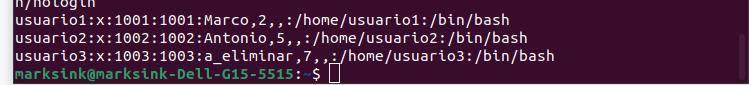
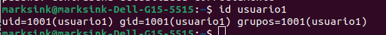
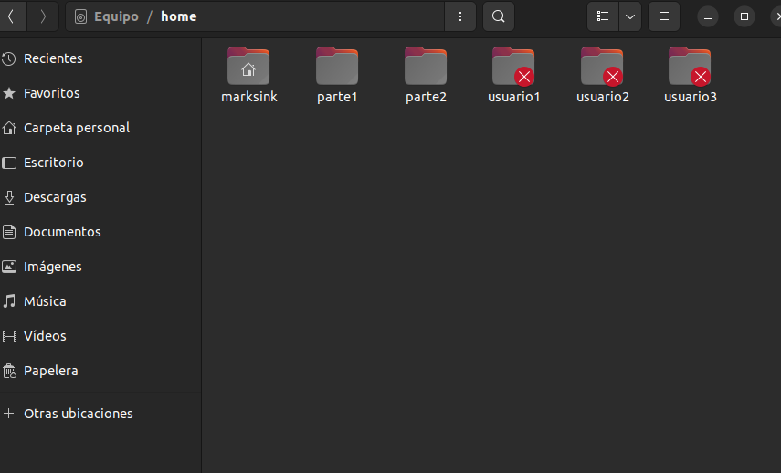
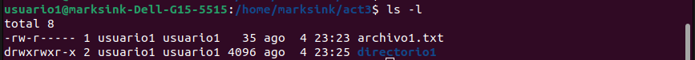
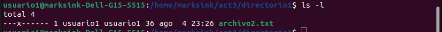
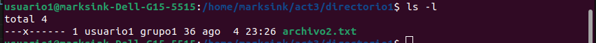
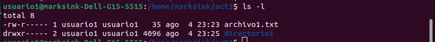
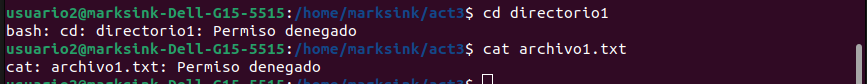
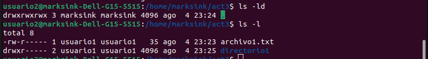

# ACTIVIDAD 3
## Marco Antonio Solis Gonzalez
## 202003220

### Parte 1
#### 1. Creacion de Usuarios
Comandos utilizados para la creacion de usuarios
##### Usuario1
- sudo adduser usuario1
- contrasena: sopes1actividad3
- nombre completo []: Marco 
- numero de habitacion: 2
- enter

##### Usuario2 
- sudo adduser usuario2
- contrasena: actividad3
- nombre completo []: Antonio 
- numero de habitacion: 5
- enter

##### Usuario3
- sudo adduser usuario3
- contrasena: sopes1act3
- nombre completo []: a_eliminar
- numero de habitacion: 7
- enter

- cat /etc/passwd

#### 2. Creacion de Usuarios
- sudo passwd usuario1
- holasopes1

- sudo passwd usuario2
- act3sopes1

- sudo passwd usuario-
- meeliminaran

#### 3. Informacion de usuarios
- id usuario1

#### 4. Elimnacion de usuarios
- sudo userdel usuario3

Aqui podemos ver que no se elimino el directorio

### Parte 2
#### 1. creacion de grupos
- sudo groupadd grupo1
- sudo groupadd grupo2

#### 2. Agregar usuarios a grupos
- sudo usermod -aG grupo1 usuario1
- sudo usermod -aG grupo2 usuario2

#### 3. Verificar membresia
- groups usuario1/2

#### 4. Eliminar grupo
- sudo groupdel grupo2

### Parte 3
Creamos una carpeta llamada act3 en la ruta /home/marksink

Ahora vamos a dar permiso a todos los usuarios la siguiente carpeta
- sudo chmod 777 /home/marksink/act3

#### 1. Creacion de archivos y directorios
- su usuario1
- touch archivo1.txt
- cat > archivo1.txt
- hola estoy escribiendo en archivo1 + (ctrl+d)
- mkdir directorio1 
- cd directorio1
- touch archivo2.txt
- cat > archivo2.txt
- Ahora estoy escribiendo en archivo2 + (ctrl+d)

#### 2. Verificar permisos
- exit 
- ls -l
- ls -ld

#### 3. Modificar Permisos usando chmod con Modo Numérico
- su usuario1
- chmod 640 archivo1.txt

#### 4. Modificar Permisos usando chmod con Modo Numérico
- cd directorio1
- chmod 100 archivo2.txt

#### 5. Cambiar el grupo propietario
- chown :grupo1 archivo2.txt

#### 6. configurar permisos del directorio
- cd ..
- chmod 740 directorio1

#### 7 Comprobación de Acceso:
- su usuario2
- cat archivo1.txt
- cd directorio1

#### 8 Verificación Final

